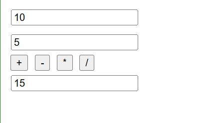

#  TP2 JavaScript — Introduction des événements en JavaScript 

Exercices d'initiation au JavaScript avec manipulation du DOM (Document Object Model).  

---

## Structure du projet

```
 TP-JavaScript/
├── ex1.html   → Permutation de deux valeurs
├── ex2.html   → Calculatrice Simple
└── ex3.html   → Calculateur d'IMC
└── ex4.html   → Calculatrice Avancée
```

## Exercice 1 — Permutation de deux valeurs

L'utilisateur entre deux valeurs dans deux champs de texte.  
En cliquant sur le bouton **Permuter**, les deux valeurs s'échangent.

### Concepts abordés

- `document.getElementById()` — accéder à un élément HTML
- `.value` — lire ou modifier le contenu d'un champ input
- Variable temporaire pour la permutation

### Aperçu

**Avant le clic :**  


**Après le clic :**  


---

## Exercice 2 — Calculatrice simple

L'utilisateur entre deux nombres, puis clique sur un des quatre boutons : `+`, `-`, `*`, `/`.  
Le résultat s'affiche dans un troisième champ.

### Concepts abordés

- `parseFloat()` — convertir une chaîne de caractères en nombre décimal
- Fonctions JavaScript : `addition()`, `soustraction()`, `multiplication()`, `division()`
- `onclick` — déclencher une fonction au clic d'un bouton

### Aperçu



---

## Exercice 3 — Calculateur d'IMC

L'utilisateur entre son poids (en kg) et sa taille (en mètres).  
En cliquant sur **Calculer**, la page affiche son IMC et la catégorie correspondante.

L'IMC se calcule avec la formule :

```
IMC = poids ÷ (taille × taille)
```

C'est un exercice pour pratiquer les **conditions `if / else if / else`** et l'affichage dynamique de texte avec `innerHTML`.

### Concepts abordés

- `parseFloat()` — conversion des saisies
- `toFixed(2)` — arrondir à 2 décimales
- `if / else if / else` — structure conditionnelle
- `innerHTML` — modifier le contenu d'un élément HTML

### Catégories IMC

| IMC | Catégorie |
|-----|-----------|
| < 18.5 | Insuffisance pondérale |
| 18.5 – 24.9 | Corpulence normale |
| 25 – 29.9 | Surpoids |
| 30 – 34.9 | Obésité modérée |
| 35 – 39.9 | Obésité sévère |
| ≥ 40 | Obésité morbide |

### Aperçu


---


## 🛠️ Technologies utilisées

- HTML5
- CSS3
- JavaScript
